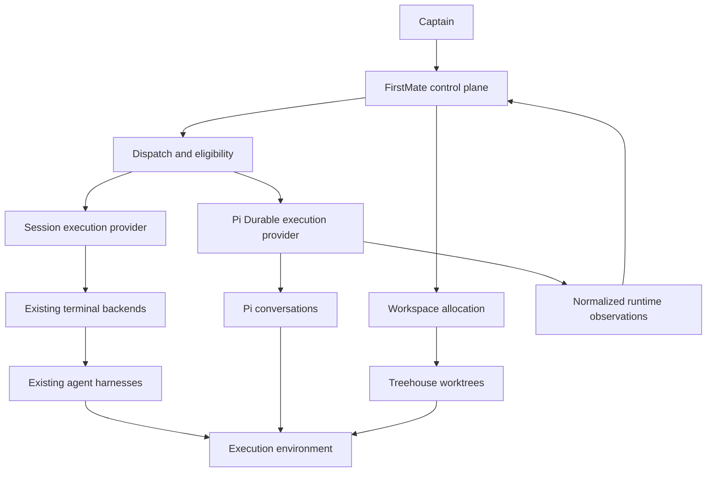
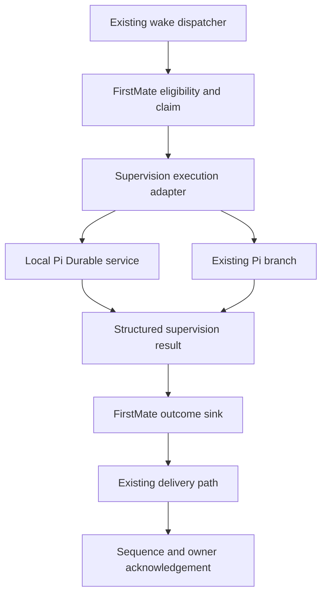

# FirstMate Pi Durable Integration Architecture

Version 1.0 • 3 October 2026 • Status: proposed architecture

## Architectural decision

FirstMate remains the authority for task intent, eligibility, assignment, decisions, operational leases, outcomes, and integration. Pi Durable is an optional provider for executing Pi conversations. Treehouse remains the normal crewmate workspace provider. Existing terminal/session backends continue to serve the current harnesses.

This document specifies the target boundaries and the narrower supervision prototype. Read [the project design](01-project-design.md) for scope and gates and [the implementation plan](03-implementation-plan.md) for work packages. Interface names and schemas below are proposed FirstMate contracts. They are not assertions about existing upstream APIs.

## Target topology



The shared execution provider layer is a later extraction. The prototype inserts a small provider seam in the existing Pi supervision path. It does not route all workers through this topology on day one.

## Ownership

| Domain | Authority | Adapter responsibility |
| --- | --- | --- |
| Task and wake identity | FirstMate | Pass immutable correlation keys |
| Row eligibility and posture | FirstMate | Submit only the exact accepted scope |
| Generation and operational leases | FirstMate | Validate authority before every effect |
| Outcomes and delivery acknowledgements | FirstMate | Reconcile settlement into the existing outcome sink |
| Model and tool execution records | Pi Durable | Expose records through supported APIs |
| Conversation transcript and recovery | Pi Durable | Preserve identity and pin recovery configuration |
| Worktree allocation and release | FirstMate workspace provider | Bind validated cwd; never allocate or release independently |
| Provider request and transport records | Adapter | Persist command acceptance and correlation metadata |
| Capability grants | FirstMate policy | Install only the granted typed tools |
| Runtime observations | Provider | Normalize facts without declaring task success |

The adapter may keep technical execution metadata in its runtime store. It must not maintain a competing task lifecycle or a second authoritative copy of merge authority.

## Prototype topology



Choose one execution path before accepting work. The initial durable supervisor observes and returns structured findings. Any resulting control operation still enters the existing FirstMate guards. A later increment can expose selected mutating supervision tools after the lease and idempotency tests pass.

The supervisor's cwd follows the existing branch context, validated for the isolated home. It does not need a fresh Treehouse worktree simply because the runtime changes. Durable crewmates later receive the exact workspace allocated by FirstMate.

## Service boundary

Run one local sidecar owner per canonical `FM_HOME` and runtime store. It can host multiple conversations later, but the prototype needs only the supervision conversation and test fixtures. A home identity distinguishes otherwise similar paths, linked homes, or restored configurations.

Use a Unix-domain socket in a private directory, validate peer identity where supported, and restrict directory, socket, and store permissions. Acquire a store-owner lock before opening the harness; a second owner must refuse startup. A PID file alone is insufficient. The lock lives for the owner's lifetime and must prevent two processes opening the same store concurrently.

The socket offers schema-validated bounded JSON requests. Secrets are configured out of band; credentials do not belong in persisted request payloads. Limit message sizes, outstanding operations, model concurrency, and retained diagnostic output. A responsive socket demonstrates service availability, not valid FirstMate authority.

Use the upstream SQLite provider for the initial persistent store, proposed at `$FM_HOME/state/pi-durable/runtime.sqlite`. Treat this as a configurable path with a recorded home binding. Do not implement independent SQL readers or infer runtime state from database tables. Pin the actual provider and supported JavaScript runtime during P0.

## Proposed operations

| Operation | Purpose | Required semantics |
| --- | --- | --- |
| `health` | Service and protocol readiness | Return protocol, dependency, home, and owner identities |
| `ensureSupervisor` | Find or create the configured conversation | Idempotent by home and logical supervisor identity |
| `submit` | Accept a supervision operation | Stable ID plus payload digest; retry returns original acceptance |
| `inspect` | Read operation execution facts | Include state, authority binding, and pending reconciliation |
| `observe` | Get normalized observations | Cursor or snapshot semantics declared by the adapter |
| `cancel` | Request cancellation of owned execution | Persist request; identify cancellation scope; report unresolved effects |
| `reconcile` | Repair transport and settlement gaps | Consult FirstMate authority and supported runtime APIs |
| `shutdown` | Stop the service owner | Distinguish graceful persistence from task cancellation |

A later worker contract may add `create`, `attach`, `steer`, `resume`, and `destroy`. A resumed conversation must recover its recorded tool, model, and environment configuration; it cannot silently adopt new privileges. Removal of an execution record and release of a worktree are separate FirstMate-controlled operations.

## Identity and deduplication

Every operation carries `homeId`, `supervisorId`, `ownerGeneration`, `wakeClaimId`, the immutable accepted row IDs, and a client-generated `operationId`. A wake claim may cover several task rows; do not collapse the claim into one task ID. Runtime IDs identify the conversation, submission, and internal tasks. These identifiers are correlated but are not interchangeable.

Suggested initial identity format:

```json
{
  "protocolVersion": 1,
  "homeId": "home-example",
  "supervisorId": "pi-supervisor",
  "ownerGeneration": 17,
  "wakeClaimId": "claim-example",
  "operationId": "fm:home-example:supervision:claim-example:17",
  "rowIds": ["row-101", "row-102"],
  "payloadDigest": "sha256-of-canonical-input",
  "capabilityProfile": "supervision-observe-v1"
}
```

The adapter also records a configuration digest covering model, effort, prompts, extension versions, and environment binding. Canonicalization and digest rules are protocol requirements. The same operation ID with a different input or configuration is a conflict, not an update. Steering is a new operation with its own identity.

Use the operation ID as, or deterministically map it to, the Durable submission request ID. Confirm upstream deduplication scope and retention in the pinned version. Durable submission deduplication does not make Git pushes, status appends, remote APIs, or human-visible delivery exactly-once.

## Cross-store consistency

There is no atomic transaction spanning FirstMate files and the runtime store. Use durable intent and reconciliation instead of pretending both commits happen together.

1. FirstMate records the accepted scope, generation, operation ID, and digest in a durable command record using its existing storage conventions.
2. The adapter ensures the conversation and submits the command under the deterministic request ID.
3. FirstMate records runtime acceptance when the response arrives. A lost response leaves acceptance unknown.
4. Recovery looks up the operation through the adapter. If the runtime accepted it, reconnect to that execution. If absence is conclusively established, retry the same ID.
5. Runtime settlement produces a candidate outcome. FirstMate validates the current claim, generation, and exact scope before committing it to its outcome sink.
6. Existing delivery and acknowledgement operate on that FirstMate record. The runtime may record a mirrored delivery receipt for reconciliation, but the FirstMate record remains authoritative.

The initial create/find mapping must survive a crash before FirstMate records the conversation ID. Prefer an atomic create-or-find technical record within the runtime store when the pinned APIs permit it. Otherwise define a durable adapter mapping with explicit recovery and duplicate-conversation quarantine before implementing the happy path.

A settled result is retained until FirstMate commits or explicitly rejects it. A cursor advances only after its corresponding FirstMate effects are durably recorded. Repeated settlement delivery must find the existing receipt. If the current sink cannot deduplicate a particular record class, report and test that limitation; do not silently change its semantics.

## State and interpretation

Track three independent dimensions: execution state, authority state, and delivery state. This avoids declaring an operation complete because the conversation is idle.

| Dimension | Proposed states |
| --- | --- |
| Execution | queued, running, waiting, settled, failed, cancel requested, aborted, effect unresolved |
| Authority | valid, expired, superseded, unknown |
| Delivery | none, candidate available, outcome committed, delivered, acknowledged, rejected |

Only FirstMate can interpret these into fleet task states. Model response completion is not task completion. Runtime idle is not a valid outcome. Tool completion is an activity observation, not proof that tests passed. Background task state must remain visible even when a conversation reports idle.

## Fencing and startup recovery

Before enabling mutating execution, bind every tool call to a current FirstMate home, generation, scope, and capability profile. The guard is evaluated again at the actual mutation boundary under the existing claim serialization. A check at submission time alone is vulnerable to authority changing while a model call runs.

On startup, acquire exclusive store ownership, install the pinned tool registry, reconnect to FirstMate authority, and classify outstanding operations before resuming mutating execution. If the upstream resume operation is harness-wide, all mutation tools must already refuse stale or unknown bindings. Do not call unrestricted resume and add guards afterwards.

Same-generation recovery preserves the original operation ID. A genuinely new owner uses a new generation and cannot accidentally reactivate the old execution. Superseded work is quarantined or aborted; transfer requires explicit FirstMate reconciliation. The sidecar's process epoch is separate from FirstMate's logical owner generation, so an ordinary service restart does not manufacture a new control-plane owner.

## Tool capabilities and replay

The initial supervisor receives typed snapshot and result tools without arbitrary shell, project writes, merge, or deployment. Invocation uses structured arguments or fixed argv arrays and derives authority from the service binding rather than accepting a model-supplied generation as truth.

| Tool category | Default recovery treatment | Condition for replay |
| --- | --- | --- |
| Read snapshots and bounded searches | Candidate for safe replay | No side effects and stable authority checks |
| Read Git state | Candidate for safe replay | Fixed command and validated repository |
| Tests | Unsafe by default | Explicitly isolated and demonstrated free of external effects |
| Status or signal append | Unsafe unless wrapped | Durable operation key and idempotent sink |
| Supervision control action | Unsafe unless wrapped | Current fenced authority and operation receipt |
| General bash or file edit | Unsafe by default | Specific operation analysis and reconciliation |
| Push, merge, deployment, worktree release | Excluded initially | Later explicit authority and external-effect protocol |

Upstream replay declarations are not an external transaction system. Recovery can still encounter an effect that happened before its receipt was committed. Reconcile that effect from the target system, or mark it unresolved. Avoid claiming arbitrary test commands or shell calls are safe.

Removing write tools is useful capability reduction but is not adversarial containment. A shell, network access, credential access, or an unrestricted local environment can bypass the intended role. The prototype uses narrow tools; future hostile-input containment requires an operating-system boundary and credential isolation.

## Observation and event bridge

Normalize provider observations into facts such as operation started, tool interrupted, result available, cancellation pending, and runtime unavailable. Include home, generation, operation, runtime identity, event identity, timestamp, and schema version. FirstMate decides whether a fact merits a wake, status update, recovery action, or escalation.

Do not assume the upstream live event stream is a retained replay log. P0 must verify reconnect, cursor, ordering, and snapshot guarantees. When a retained event history is unavailable, maintain a durable adapter outbox and recover settlement through supported snapshots. Transient progress may be coalesced; settlement and unresolved-effect observations must be recoverable.

A reconnect first establishes a snapshot/cursor boundary and then follows newer observations. Detect gaps and reconcile; never advance a cursor merely because bytes were received. Runtime unavailability remains distinct from agent failure and from task completion.

## Cancellation and resource cleanup

Persist cancellation intent before requesting runtime abort. Specify whether the operation, owned foreground tasks, or background tasks are included. The prototype prohibits untracked background work. Verify the pinned ownership rules rather than assuming parent abort reaches every possible task.

Abort is not rollback. An external effect may already exist, and a shell child may outlive a canceled tool. Confirm completion of the ownership tree, process termination where applicable, and any remaining unresolved effects before reporting settled cancellation.

Cancellation retains the outcome records, transcript, and workspace. FirstMate controls subsequent release or archival. Timeout produces an unresolved state and an escalation; it does not free a worktree or authorize a replacement executor.

## Operations and future extensions

Record runtime versions, model settings, configuration digests, operation states, recovery attempts, duplicate retries, event gaps, and authority rejections. Logs redact credentials and bound transcript fragments. Store backup and upgrade procedures must respect exclusive ownership and supported SQLite backup rules. Test restore into an isolated home, and refuse a restored store attached to an unrelated live home.

Later dispatch records can add runtime and capability profile while retaining backward-compatible defaults. Compatibility filtering precedes routing preference. Remote environments require authenticated environment identities and durable job receipts so a disconnected network cannot trigger blind command replay.

External `execution-runtime/1` packaging follows stabilization of this contract. Installation trust, declared capabilities, protocol negotiation, digest verification, upgrade rollback, and state compatibility belong in that later design. Neither remote execution nor packaging is required to prove the supervision prototype.

## References and unresolved API checks

See the evidence statement and sources in [the project design](01-project-design.md). Before implementation, verify exact conversation lookup/create APIs, request-ID scope, cancellation scope, registry configuration persistence, event recovery, SQLite durability settings, and supported runtime versions against pinned source. Unresolved signatures are deliberately not presented as executable examples here.
