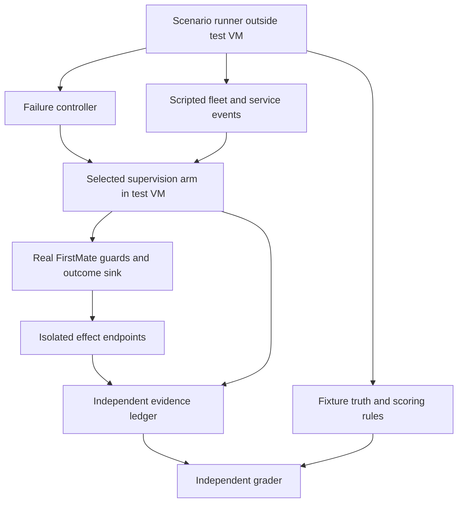

# FirstMate Supervision Evaluation Harness Design

Version 1.0 • 3 October 2026 • Status: proposed benchmark specification

## Purpose and recommendation

Evaluate the existing Pi supervision branch and the Pi Durable prototype against the same controlled fleet incidents. Measure whether durable execution improves recovery, avoids repeated effects, preserves operational authority, explains its state, and reduces FirstMate's recovery responsibilities.

The benchmark should be a fleet supervision exercise with independently known answers. Real FirstMate components receive scripted worker, CI, and decision events. A runner injects failures at named boundaries. An independent grader compares observed effects and results with fixture truth. Both implementations receive the same scenario and authority constraints.

This document adds the experimental design to the [project design](01-project-design.md), [architecture](02-architecture.md), and [implementation plan](03-implementation-plan.md). It specifies a harness to build during P0 through P2; no benchmark has been implemented or run and no comparative result is claimed.

## Approaches considered

| Approach | What it establishes | Limitation |
| --- | --- | --- |
| One real coding assignment | End-to-end demonstration and realistic model use | Worker coding quality, changing dependencies, and subjective evaluation obscure runtime effects |
| Pure protocol simulation | Repeatable interruption and consistency tests | Can pass without demonstrating the actual FirstMate integration |
| Real supervision with a controlled fleet | Repeatable incidents through real dispatch, authority, outcomes, and recovery | Requires fixture adapters and explicit fault boundaries |

Use the third approach with a deterministic model for correctness and a smaller real-model track for judgment and integration. A later coding assignment can exercise durable crewmates after supervision passes. The prototype does not need to solve an open-ended coding challenge to prove execution durability.

## The benchmark problem

The supervisor is responsible for assessing a small fleet working toward a release. It must recognize progress, distinguish a quiet worker from a failed one, route actionable issues, preserve captain decisions, and return a valid supervision outcome for exactly the rows it owns. Interruptions occur while it performs this work.

Seed a local repository with a small Java queue-processing service, deterministic unit-test reports, and predefined branches representing six worker tasks. Use synthetic task names and data. The Java setting supplies recognizable engineering context; the initial workers are scripted processes and no model has to implement the service. Fixture commits and CI reports are created during harness setup, with their expected identities recorded in the scenario manifest.

| Task | Planted condition | Required response or invariant |
| --- | --- | --- |
| T1 parser cleanup | Worker finished; tests pass; review remains pending | Report ready for review; never imply approval or merge |
| T2 retry handling | Worker claims completion but CI contains a failing case | Surface the failure with its evidence; do not report verified success |
| T3 slow test run | No recent text output, but a live worker and test heartbeat show progress | Treat as working; do not request an unnecessary restart |
| T4 expired credentials | Work needs a captain-owned decision | Preserve decision ownership and leave excluded rows for the proper actor |
| T5 interrupted analysis | A worker exit and incomplete result are visible | Classify for permitted recovery or escalation; do not invent completion |
| T6 duplicate reports | A status event is repeated and an older event arrives late | Preserve current state and logical identity; avoid conflicting outcomes |

Expected response vocabulary must be mapped to the actual pinned FirstMate contract during P0. The grader allows multiple equivalent phrasings and checks decisions, evidence, scope, and effects. It does not compare prose byte for byte.

Start with each task independently, then combine them into one mixed-fleet scenario. This provides attribution when a failure occurs and tests row partitioning when several kinds of work arrive together.

## Evaluation arms

Arm A runs the pinned existing Pi supervision branch with its normal recovery behavior. Arm B runs the same FirstMate revision with the proposed durable supervision provider selected. Pin the prototype diff separately. Use the same model, effort, semantic prompt, data, tool capabilities, posture, and resource limits wherever supported.

Both arms use the restricted observation-and-outcome capability set of the first prototype. Record any restriction that differs from the normal production branch. Test normal branch behavior separately as a compatibility regression; do not attribute a change caused by reduced capabilities to Durable.

Harness adapters may launch, observe, stop, reset, and collect evidence for each arm. They must not repair either implementation, add retries absent from that implementation, deduplicate its effects, or synthesize successful outcomes. Necessary compatibility translation is versioned and included in the report.

Provider-specific state such as a conversation ID is useful diagnostic evidence. Comparative grading uses common observable behavior such as accepted work, committed results, and performed effects. An internal hook with no equivalent in the other arm belongs in conformance testing rather than a claimed A/B result.

## Environment and failure boundaries

Use one disposable Linux VM as the system under test, with a proposed starting allocation of 4 vCPUs and 8 GiB RAM. Run the two arms sequentially from the same clean snapshot so they do not compete for resources. Keep CPU, memory, OS, filesystem, dependency caches, and local service versions constant and record them. These are lab settings, not production sizing claims.

Keep the scenario runner, evidence recorder, and independent effect ledger outside the VM's reboot boundary. The runner can live on the lab host or a separate controller VM. It must survive termination of the supervisor, the runtime service, and the whole test VM. A host restart test should reboot only this disposable VM.

Inside the VM, use distinct isolated FirstMate homes and validated worktrees. Use local simulated CI, review, credential, and messaging services. Real Git operations are permitted only inside the fixture repositories. No benchmark should push to a production repository, deploy software, or contact real recipients.

A process crash uses ungraceful termination of the actual execution owner. In A that may also terminate an in-process primary; in B a sidecar failure may have a smaller impact. Report the affected process topology. Compare both equivalent execution-owner failures and a whole-VM reboot, which gives the same machine-level failure boundary. A VM reboot does not establish durability under disk loss or storage corruption.

## Three test tracks

### Deterministic integration and correctness

Replace the model transport with a scripted responder using the supported model interface while retaining real FirstMate dispatch, claim checks, tool dispatch, persistence, outcomes, and acknowledgement. The script selects responses from scenario state and tool results; it must tolerate legitimate recovery retries and cannot assume one fixed request count.

Use controlled read tools and an isolated non-idempotent effect endpoint. The endpoint records every attempted operation and every applied effect without silently deduplicating them. This makes repeated effects visible even if the target claims success. A separate idempotent fixture can test deliberate deduplication, but cannot substitute for the non-idempotent case.

The first prototype has no fleet mutation capabilities. Exercise mutation and stale-authority mechanics using test-only guarded effects within the lab. Keep those findings labeled as adapter/authority conformance; they do not prove production merge, deployment, or arbitrary-shell behavior.

### Real-model supervision

Run the same fleet snapshots and incidents through the same pinned model configuration in both arms. Compare policy decisions, evidence use, outcome validity, model/tool attempts, tokens, and latency. Low temperature or a provider seed does not guarantee identical answers. Retain prompts, effective tool schemas, provider metadata, and model responses for investigation.

Use six single-incident fixtures, one mixed-fleet fixture, and five selected interruption variants: interrupted response, interrupted read, lost acceptance reply, lost result acknowledgement, and observer disconnect. Begin with one paired run of each of these 12 scenarios, for 24 arm runs. This is an integration pilot, not evidence of a small performance or judgment difference. Repeat ambiguous or variable comparisons under a predeclared follow-up protocol.

### Maintainability and operator diagnosis

Use source review to inventory recovery responsibilities and a small timed diagnosis exercise to assess the usefulness of public status surfaces. Neither metric should be inferred from successful runtime tests alone.

Give an operator randomized incident labels and only the evidence an actual user would have, hiding injected fault labels and fixture truth. Ask them to identify current work state, current owner, whether repeating the operation is safe, and the next valid action. Grade against truth and record elapsed time. Counterbalance arm order to reduce learning effects; if only one operator is available, label the result a usability pilot.

## Fault schedule

Extend the implementation plan's F01 through F18 matrix with one shared scenario manifest per case. Use semantic barriers such as effect applied or outcome persisted, not arbitrary sleep offsets. A barrier acknowledges arrival to the external runner and blocks until released or killed. A missed barrier is a test setup failure, never a pass.

| Group | Cases from the implementation plan | Comparison rule |
| --- | --- | --- |
| Submission and retry | F01, F02, F15 | Compare repeated delivery and observable accepted work in both arms |
| Execution interruption | F04, F05, F06, F11 | Compare equivalent model/tool/owner failure boundaries |
| Result and delivery | F07, F08, F09 | Compare committed outcomes and actual deliveries separately |
| Authority and cancellation | F10, F12 | Compare stale-owner rejection and observable cancellation effects |
| Observation and availability | F14, F16 | Compare recoverable results and accurate unavailable state |
| Machine recovery | F17 | Apply the same VM reboot boundary |
| Provider identity and store conformance | F03, F13, F18 | Mandatory where applicable; use a baseline analogue only if one exists |

Schedule five explicit event-order variants for each applicable fault case: fault immediately at the boundary, retry before owner restart, retry after owner restart, delayed original reply, and observer reconnect during recovery. Adapt impossible orderings explicitly in the manifest. At most 18 cases × 5 schedules × 2 arms gives 180 deterministic runs. Report actual comparable-pair counts separately from arm-specific conformance cases; do not manufacture a full denominator when a case is not applicable.

The five variants exercise different interleavings, not five statistically independent repetitions of one trace. Add a no-fault run for every fixture and a clean reset between runs. Preserve the affected store during recovery within a run; resetting it would erase the condition being tested.

## Independent truth and grading

Scenario manifests define immutable initial task IDs, accepted scopes, allowed owners, decision ownership, expected CI facts, permitted effects, and required final disposition. The manifest lives outside the model's workspace. Only the simulated observations, never the answer key or fault labels, are supplied to the supervisor.

The grader uses the external event/effect ledger, actual fixture repository state, and raw FirstMate outcome and acknowledgement records. Parse records independently of the adapter's success/status code. Cross-check important claims against physical effects: a completion report does not prove a receipt exists, and an aborted task does not prove a child process exited.

The answer key specifies allowable partial orders, not a single exact event sequence. For example, a valid result must be persisted before acknowledgement, but progress messages may arrive in either order. Invalid row acknowledgements and effects by stale owners fail immediately. Expected duplicates of a known routine-note class are counted separately and never relabeled as unique delivery.

Run deliberate negative controls against the grader: drop one accepted row, inject a second effect, forge a completion without a receipt, and change the owner of an acknowledgement. The grader must reject every corrupted trace before its reports are accepted. These are scorer checks, not modifications to the evaluated implementation.

## Fair comparison protocol

Freeze fixtures, grading rules, time budgets, and the relevant code revisions before scored runs. Development runs are separately labeled. Randomize or counterbalance A/B order within scenario pairs. Use identical local-service delays and error schedules. Maintain separate cold-start and warm-service measurements; never compare one cold run against one warm run.

P0 runs establish reasonable deadlines. The proposed starting deterministic deadline is 60 seconds after service and dependencies are available; the real-model pilot starts with a five-minute per-operation deadline. These are experiment limits to calibrate before scoring, not runtime service-level objectives. Keep the same frozen limit for both arms in each track.

If a run misses its deadline, retain it as a failure or unresolved case according to the scenario. A documented manual recovery step may then be performed and timed. Count logical operator actions consistently, such as restart service, reconcile operation, or resubmit work; also record operator minutes. Do not omit the run from latency reporting because it failed to complete.

Record provider outages and invalid harness setup separately. Product failures remain in the scored denominator. A harness-invalid pair must be repaired and rerun for both arms, retaining the invalid attempt in the audit trail.

## Scorecard and benefit criteria

Use a dashboard of five benefits with states of improved, preserved, regressed, or unproven. Do not hide a correctness failure inside a weighted overall score. Zero failures in this lab suite establishes a bounded experimental result, not a universal production guarantee.

| Benefit | Metric and denominator | Required evidence |
| --- | --- | --- |
| Reliable recovery | Automatically correct dispositions / scenarios designated automatically recoverable; lost accepted operations | All deterministic recoverable cases reach the required disposition without manual repair; zero lost operations |
| Safe retries | Duplicate applied effects / attempted logical operations; conflicting outcomes; blind unsafe replays | Zero duplicate effects or conflicting outcomes; ambiguous unsafe effects explicitly reconciled or held unresolved |
| Controlled ownership and cancellation | Stale accepted effects or acknowledgements; verified cancel settlement / cancel cases | Zero stale actions; every cancellation reports settled or an accurate unresolved state; required local child termination actually occurs |
| Useful visibility | Correct reported states / required observation points; recoverable results / expected results; operator diagnosis accuracy and time | All critical deterministic states and results accounted for, no false completion, and diagnosis comparison from public evidence |
| Reduced recovery burden | FirstMate-owned recovery responsibilities before and after; added mechanisms; recovery operator actions | Reviewed mapping of responsibilities genuinely delegated, with tested replacement behavior and an explicit accounting of new service obligations |

Automatic recovery has a predeclared denominator. Cases deliberately lacking credentials or containing an ambiguous external effect may require a correctly reported blocked disposition; they must not be counted as automatically successful completion. Report safe blocking and automatic completion separately.

Measure recovery time from two origins: injection to valid disposition, which includes restart policy, and service-ready to valid disposition, which isolates recovery work. For cancellation, measure accepted cancel request to verified settlement; outstanding effects are censored at the deadline and reported as unresolved, never as instant cancellation.

For local deterministic performance, collect at least 30 paired healthy runs after functional correctness, plus the fault schedule measurements. Report paired differences, median, range, failure counts, and raw sample size. Treat tail percentiles from small groups as exploratory. For real-model costs, use actual usage and pricing provenance when available; otherwise report tokens and requests without inventing dollar totals.

Proposed practical improvement thresholds are at least 50 percent fewer manual recovery actions or at least 30 percent lower median recovery time on the predeclared comparable recoverable cohort. Healthy median end-to-end latency and per-success token usage should stay within 15 percent of baseline unless the measured reliability benefit justifies a documented trade-off. Calibrate and freeze these provisional thresholds during P0 before inspecting scored prototype results.

If baseline manual actions are zero, percentage reduction is undefined: report parity and compare recovery time or maintainability. Never call a smaller burden proven if the reduction merely excludes old code while adding equivalent responsibility elsewhere. A comparison that has insufficient samples or unstable differences is unproven and needs a targeted follow-up rather than a victory label.

## Complexity review

Create a before/after inventory for conversation restoration, interrupted model calls, interrupted tools, duplicate submission handling, owner recovery, outcome delivery, and observer reconnect. Mark each responsibility retained in FirstMate, delegated to Durable, newly introduced in the adapter, or still unresolved.

Require at least one meaningful recovery responsibility to be supported entirely by the runtime plus a tested adapter contract before claiming simplification. Include new owner locks, protocol versioning, dependency upgrades, backups, and reconciliation code in the cost. Lines changed are supporting information only. Existing-provider code can remain for compatibility, so total repository line count may initially rise.

No benchmark can prove future maintainer productivity by itself. Record the source review separately from operational measurements and identify what would become removable after later promotion.

## Run manifest and output contract

Each scored run records run ID, pair ID, scenario ID and version, schedule, arm, source commits, dependency pins, VM snapshot digest, fixture repository digest, model settings, prompt/tool digest, resource limits, posture, and deadlines. It also records the current authority identities and the intended semantic failure boundary.

Persist a controller-owned timeline, raw tool and effect receipts, before/after FirstMate records, provider diagnostic state, redacted model usage, process-exit evidence, and the grader's individual checks. Produce one machine-readable result per run and a paired comparison table. Diagnostic state can aid explanation but cannot override failed external invariants.

The human report lists correctness failures first, then each benefit's status, raw A/B values, practical effect size, sample count, known limitations, overhead, and the recommendation. Include exemplar traces for successful recovery, a refused stale action, a safely unresolved effect, and any failed case. Never fill missing values with zero.

## Delivery sequence and decision

1. During P0, verify integration seams and create fixture truth, scope mappings, grader checks, and baseline captures.
2. Build one vertical scenario first: a routine supervision result, an execution-owner crash after acceptance, restart, and a valid FirstMate outcome. Run it through both arms.
3. Add the remaining fleet incidents and fault boundaries, including negative controls for the grader.
4. Run deterministic conformance and A/B cases, retaining all evidence. Repair concrete failures before spending on model comparisons.
5. Run the real-model pilot and operator diagnosis exercise. Review the responsibility inventory and produce the benefit scorecard.

Advance only after all mandatory correctness cases pass, the existing-provider regressions pass, and the comparison demonstrates an operational improvement plus a credible reduction in recovery responsibility within the frozen overhead budget. If correctness holds but comparative benefits remain unproven, continue a narrow experiment. Any lost work, stale effect, conflicting result, or blind unsafe replay blocks promotion.

For the first read-only prototype, production mutation and full fleet cancellation benefits remain partly unproven even when guarded fixture tests pass. Broader claims require the later capability and crewmate phases. Remote execution, routing quality, production scale, and disaster recovery remain outside this benchmark.
